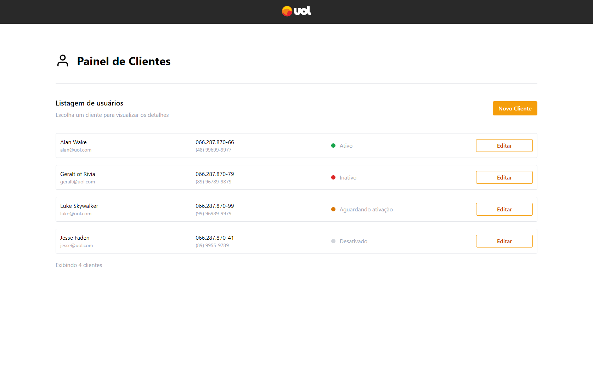
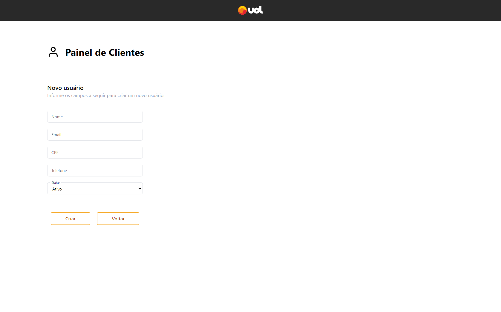
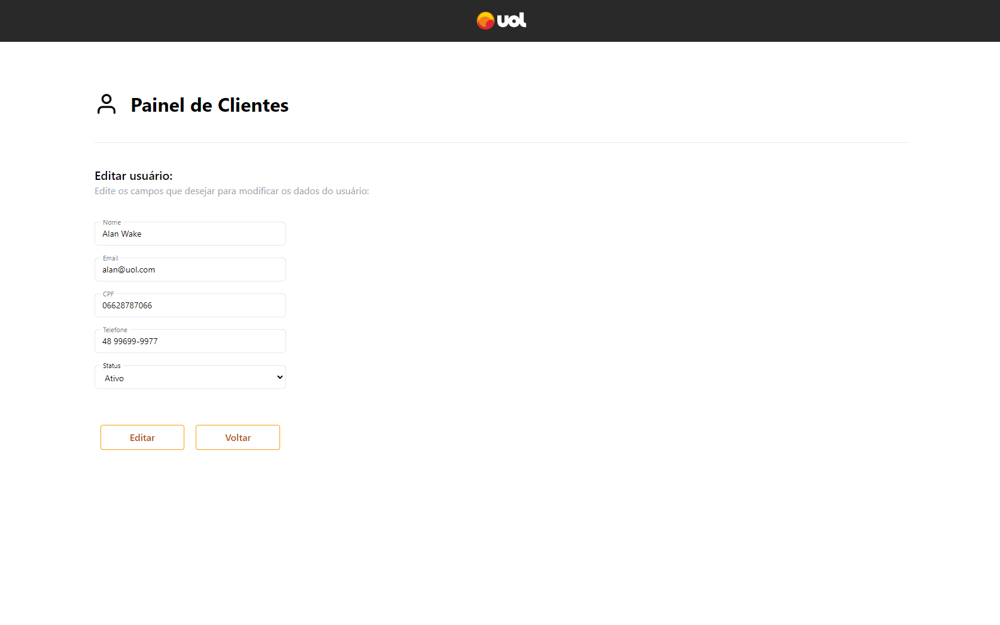

# Teste Fullstack: Aplicativo de Gerenciamento de Clientes

## Descrição:

Este aplicativo foi desenvolvido para permitir aos usuários visualizar uma lista de clientes, assim como criar um novo registro de cliente e editar um registro existente.
A interface do site foi desenvolvido pensando na experiência do usuário, contando com um layout simples e de fácil compreensão.
A aplicação foi desenvolvida utilizando Docker de forma a facilitar a inicialização dos serviços.
Durante o desenvolvimento foram adotadas algumas metodologias ágeis como quadro de Kambam para visualizar e manter organização dos requisitos e TDD no desenvolvimento de algumas rotas da API,
além do uso do Git para controle de versão.
Para iniciar o aplicativo siga os passos abaixo. Dentro dos diretórios 'frontend' e 'backend' é possível encontrar mais informações sobre as tecnologias utilizadas durante o desenvolvimento.

## Funcionalidades principais:

- Visualizar a lista de clientes cadastrados:

- Cadastrar um novo cliente:

- Editar um cliente já existente:

## Como Executar o Projeto:
  O projeto esta configurado para iniciar via Docker-compose.

## Via Docker

  1. **Execute o Docker compose:**
     
         docker-compose up --build
     
  2. Acesse o aplicativo em seu navegador em http://localhost:3000

## Executar localmente
  Para executar localmente é necessário iniciar o container do banco de dados:
  1. Execute o comando a seguir no diretório raiz:
       docker-compose up database

  2. Acesse o diretório 'backend':
    - instale as dependências:
       npm install

  3. Renomeie o arquivo ' .env.example ' e descomente as variáveis de ambiente;

  4. Acesse o arquivo 'backend/src/database/config/database.ts' e descomente a propriedade 'port' na linha 10.

  5. Execute o comando:
       npm start

  6. Acesse o diretório 'frontend':
    - instale as dependências:
      npm install

  7. Execute o comando:
       npm start

## Atenção:
  Para iniciar o projeto novamente via Docker é necessário desfazer os passos 3 e 4.

